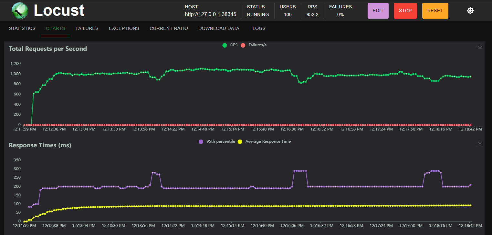

This article discusses the automation of credential rotation with Vault for applications that do not natively support it. The complete repository can be found [here](https://github.com/mattefara/k8s-wave-test). 

## Introduction to Tools

### Vault

One of the appealing features of Vault is the [dynamic secrets](https://developer.hashicorp.com/vault/tutorials/db-credentials/database-secrets). 
These types of credentials are automatically rotated after a fixed period, such as database credentials.

Typically, applications must support this feature, which means that there is often an integration with Vault at the application layer. 
In other words, the application itself must support Vault. 

Vault offers another type of integration with init containers and sidecars.
Specifically, with the sidecar, the application must reload its configuration after the credential rotation, but this feature is not always supported.

### Wave

`Wave monitors Deployments, StatefulSets, and DaemonSets within a Kubernetes cluster and ensures that their Pods always have up-to-date configuration.`
Wave introduces itself with this statement and can be useful in this case.
When a configuration changes, Wave performs a rollout strategy so that the application can use new configurations.

At this point, what is missing is something that can update Secrets with the values in Vault, keeping them synchronized.

### External Secret Operator (ESO)

The External Secret Operator is a tool that monitors and synchronizes Kubernetes Secrets with others from an external source.
This tool supports a variety of external sources like AWS, CPG, Vault, etc. 
A list of providers can be found [here](https://external-secrets.io/latest/provider/hashicorp-vault/).

This tool adds the missing piece for full integration.
It is responsible for reading the credentials at time intervals from Vault and writing them as a Secret in Kubernetes.

To summarize: credentials can be generated from Vault and expire after a fixed amount of time, ESO requests new credentials from Vault and saves them as Secrets in Kubernetes, Wave watches these secrets and updates the Deployments using them.

## Hands-On

### Vault Setup

#### Installation
Vault can be installed using the [Helm Chart](https://developer.hashicorp.com/vault/docs/platform/k8s/helm#using-the-helm-chart).
For demonstration purposes, raft is disabled, using a single instance with storage as a file.
```yaml
server:
  standalone:
    config: |
      ui = true

      listener "tcp" {
        tls_disable = 1
        address = "[::]:8200"
        cluster_address = "[::]:8201"
        # Enable unauthenticated metrics access (necessary for Prometheus Operator)
        telemetry {
          unauthenticated_metrics_access = "true"
        }
      }
      storage "file" {
        path = "/vault/data"
      }

      # Example configuration for enabling Prometheus metrics in your config.
      telemetry {
        prometheus_retention_time = "1h"
        disable_hostname = true
      }
```
With this configuration, the application exposes metrics that can be scraped with Prometheus.

Also, TLS is disabled because the work can be left to services like Istio, but in this case, it is only for demonstration purposes. 

#### Kubernetes Integration
Kubernetes Service Accounts can be authenticated with Vault, so they can generate database credentials with an API call. The full configuration can be found [here](https://developer.hashicorp.com/vault/docs/auth/kubernetes#configuration).

In this demonstration, long-lived tokens described [here](https://developer.hashicorp.com/vault/docs/auth/kubernetes#continue-using-long-lived-tokens) will be used.

#### Database Secret Engine
Vault supports different plugins for database credential creation and rotation, and the list can be found [here](https://developer.hashicorp.com/vault/docs/secrets/databases#database-capabilities). 
In this case, the [Postgres database secret engine](https://developer.hashicorp.com/vault/docs/secrets/databases/postgresql) is used.

### External Secret Operator Setup

Like Vault, ESO can be installed using a [Helm Chart](https://external-secrets.io/latest/introduction/getting-started/).
In this case, the configuration stored in the `values.yaml` file is the default.

#### Connecting to Vault and Storing Secrets

Firstly, a Kubernetes Service Account token is needed for the demonstration.
The service account is called Vault, and is responsible for the authentication with Vault for the generation of the dynamic secret.
```yml
apiVersion: v1
kind: ServiceAccount
metadata:
  name: vault
---
apiVersion: v1
kind: Secret
metadata:
  name: vault-k8s-auth-secret
  annotations:
    kubernetes.io/service-account.name: vault
type: kubernetes.io/service-account-token
```
After the service account, it's time to instruct ESO to generate secrets from Vault.
This is possible with the CRD `VaultDynamicSecret`, which defines how ESO should call the API of Vault.
In this resource, the role to use inside Vault during the generation and the Service Account requesting it are defined.
From the Vault API specifications, the API call must be made with the `GET` method.

The `ExternalSecret` resource, on the other hand, is used for storing the secret inside Kubernetes.
From the parameters, it is possible to specify the `generatorRef`, which is a link to the `VaultDynamicSecret` used above.

```yml
apiVersion: generators.external-secrets.io/v1alpha1
kind: VaultDynamicSecret
metadata:
  name: "pg-secret"
spec:
  path: "/database/creds/readonly"
  method: "GET"
  provider:
    server: "http://vault.vault.svc.cluster.local:8200"
    auth:
      kubernetes:
        mountPath: "kubernetes"
        role: "readonly"
        serviceAccountRef:
          name: "vault"
---
apiVersion: external-secrets.io/v1beta1
kind: ExternalSecret
metadata:
  name: "pg-secret-com"
spec:
  refreshInterval: "2m"
  target:
    name: pg-secret-com
  dataFrom:
  - sourceRef:
      generatorRef:
        apiVersion: generators.external-secrets.io/v1alpha1
        kind: VaultDynamicSecret
        name: "pg-secret"
```
After these steps, a new secret, called `pg-secret-com`, will be generated and it will have two keys called `username` and `password`.
The secret will be synchronized every `refreshInterval` time and the Kubernetes secret will be overridden.

### Wave Setup

Like the other applications, Wave can be installed using its [Helm Chart](https://github.com/wave-k8s/wave) and no further configuration is needed.

#### Watching for Config Updates
To instruct Wave to watch for configuration is straightforward.
The only required annotation is: `wave.pusher.com/update-on-config-change: "true"`
From now on, the Deployment will be watched and restarted every time the Secret `pg-secret-com` updates.

```yaml
apiVersion: apps/v1
kind: Deployment
metadata:
  ...
  annotations:
    wave.pusher.com/update-on-config-change: "true"
spec:
  ...
  template:
    ...
    spec:
      containers:
      - name: demo
        ...
        env:
        - ...
        - name: DB_USER
          valueFrom:
            secretKeyRef:
              name: pg-secret-com
              key: username
        - name: DB_PASSWORD
          valueFrom:
            secretKeyRef:
              name: pg-secret-com
              key: password
```
## Load Testing with Locust
The configuration must be validated.
For this reason, it will be load tested using [Locust](https://locust.io/).

Locust is a load testing tool that is really simple to start with.
The configuration is written in Python.

```python
from locust import FastHttpUser, between, task


class WebsiteUser(FastHttpUser):

    @task
    def index(self):
        self.client.get("/")
```
In this case, performance is not important but failures are.



In this case, after three deployments caused by Wave, the request failures are at 0%.
Every time a new deployment is started, new Vault credentials are generated while the others do not expire immediately.

The API called is really simple, it just tests a database connection with every request.

```golang
http.HandleFunc("/", func(w http.ResponseWriter, r *http.Request) {
  rows, err := db.Queryx("SELECT pg_sleep($1)", pg_sleep)
  if err != nil {
          log.Panic(err)
  }
  defer rows.Close()

  fmt.Fprintf(w, "Ok")
})
```

## Conclusions

Using this method, it is possible to integrate dynamic secrets using Vault with applications that do not support it. This increases complexity because two new tools, ESO and Wave, come into play. However, the maintenance appears to be relatively simple.

The test conducted with Locust is not a performance test; it merely checks if the solution works. The standard deployment uses three replicas for the tested application, showing good results with no connection errors.

If the number of replicas decreases, there are some connection errors, but they are less than 1% during the load of 1000 RPS. Nevertheless, the application attempts to shut down gracefully, terminating connections before closing down.
